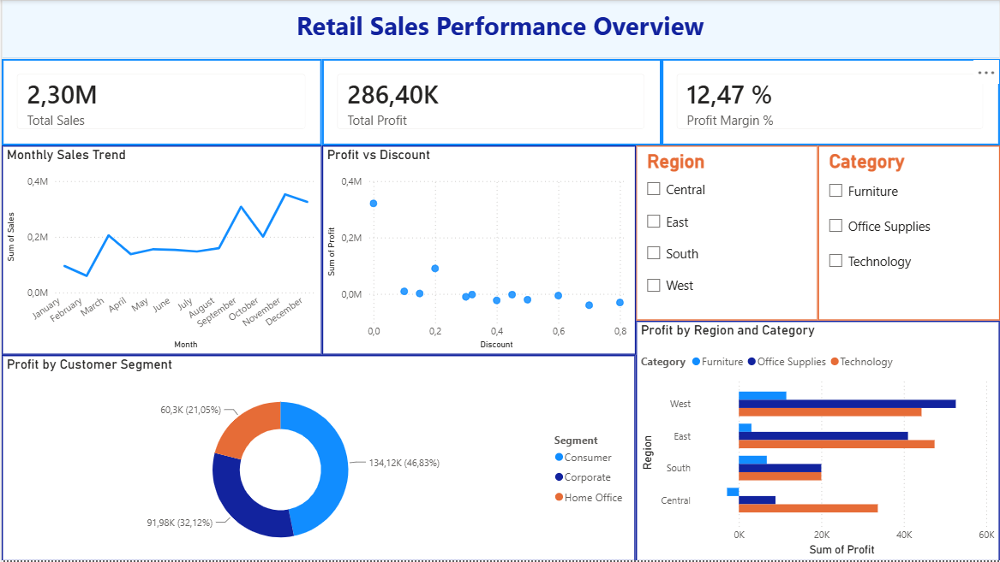

# Retail Sales Performance Analysis

## Business Context
Acting as the analyst for a fictional retail company, this project answers a set of business questions leadership raised ahead of quarterly planning — specifically around regional/category performance, discount impact on profitability, and customer segment margins. The full request is documented in `docs/stakeholder-request.md`.

## Data Source
Superstore Sales dataset (~9994 rows). Contains order-level retail transaction data including region, category, segment, sales, discount, and profit fields.

## Tools Used
- **SQL (SQLite)** — data querying, aggregations, window functions (RANK, running totals), CTEs
- **Excel** — data cleaning (Power Query), pivot tables, XLOOKUP, SUMIFS/COUNTIFS, KPI calculations
- **Power BI** — interactive dashboard with filters, KPI cards, and trend visuals

## Workflow
1. **Intake** — stakeholder request (`docs/stakeholder-request.md`)
2. **Data cleaning** — Power Query, duplicates/nulls/formatting fixes (`docs/data-cleaning-log.md`)
3. **SQL analysis** — exploratory + business-question queries (`sql/`)
4. **Excel modeling** — pivot tables, KPI formulas (`excel/superstore-model.xlsx`)
5. **Power BI dashboard** — interactive visuals (see preview below)
6. **Delivery** — executive summary for a non-technical reader (`reports/executive-summary.pdf`)

## Dashboard Preview


## How to Reproduce
1. Import `data/cleaned/superstore_cleaned.csv` into SQLite (or your preferred SQL tool)
2. Run the queries in `sql/` in order (`01_exploratory_queries.sql`, then `02_business_answers.sql`)
3. Open `excel/superstore-model.xlsx` to review pivot tables and KPI formulas
4. Open the Power BI file (`.pbix`) to explore the interactive dashboard, or view the published link: [add link if published]

## Repository Structure
```
retail-sales-analysis/
├── README.md
├── docs/
│   ├── stakeholder-request.md
│   └── data-cleaning-log.md
├── data/
│   ├── raw/
│   └── cleaned/
├── sql/
├── reports/
│   └── executive-summary.pdf
└── screenshots/
    └── dashboard-overview.png
```
